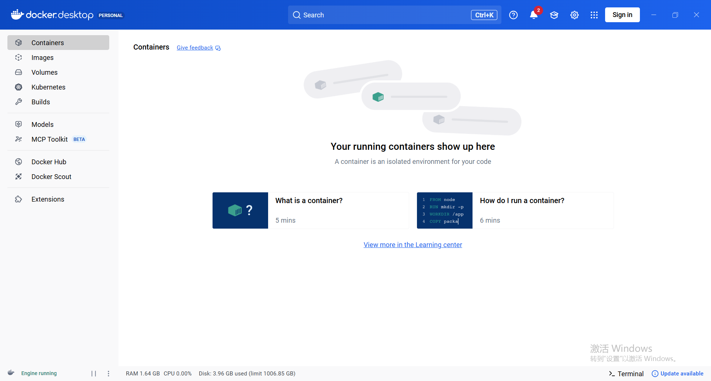
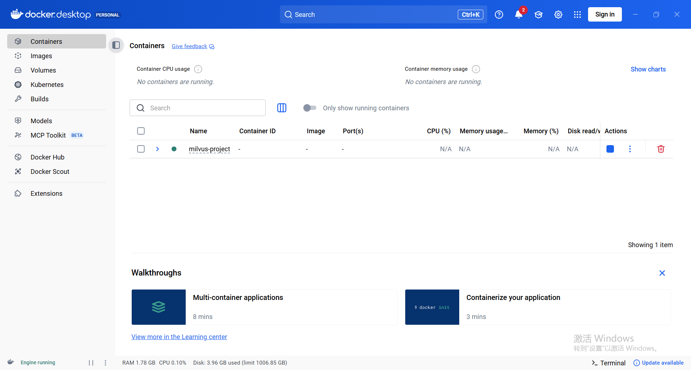
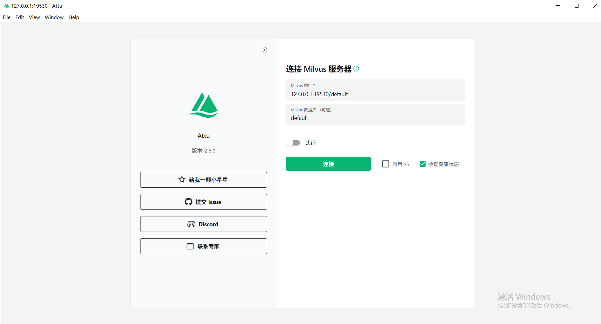
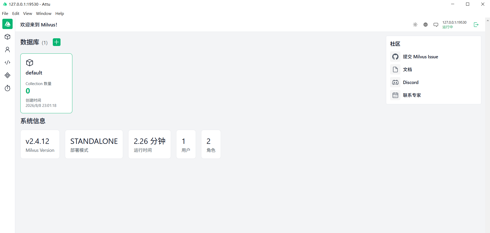
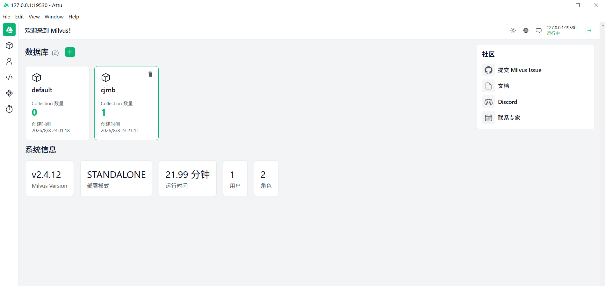

# 📚 基于RAG的智能编程助手（初级版）

这是一个基于大语言模型（Large Language Model, LLM）、视觉语言模型（Vision Language Model, VLM）以及向量数据库的检索增强生成系统（Retrieval-Augmented Generation, RAG）。本项目是最最最初级的RAG，后续还会持续优化！！！

>本项目是主包第一个有关LLM Agent的小小小项目，代码由我大一上时参加的课题组的老师提供，我在2026年的暑假对其进行全面理解并进行详细批注，然后独自跑通后整理并撰写这个项目。


本项目实现了一个完整的多模态 RAG Pipeline，实现从非结构化文档到智能问答的全过程：

- 使用 **Qwen-VL** 完成图片OCR；
- 使用 **BGE-large-zh-v1.5** 完成文本向量化；
- 使用 **Milvus** 作为向量数据库存储知识；
- 使用 **Docker** 作为数据库容器
- 使用 **Attu** 可视化Milvus数据库的存储情况
- 使用 **Qwen3-Coder-Plus** 基于检索结果生成答案。


---

# ✨ Project Overview

传统大语言模型（LLM）存在两个主要问题：

1. 模型训练数据无法覆盖用户的私有知识；
2. 长文本直接输入模型会造成 Token 消耗增加，并降低模型对关键信息的关注能力。


因此，本项目采用 RAG 架构：

```
             User Question

                   ↓

          Question Embedding

                   ↓

          Vector Similarity Search

                   ↓

          Retrieve Top-K Chunks

                   ↓

          Prompt Construction

                   ↓

          Large Language Model

                   ↓

                Answer
```

通过外部知识库增强大模型，使其能够基于指定文档完成更加准确、可靠的回答。


其中：

## Retrieval阶段

负责：

- 将问题转换为向量；
- 在知识库中寻找语义相关内容；
- 返回最相关的文本片段。


## Generation阶段

负责：

- 理解用户问题；
- 结合检索到的上下文；
- 生成最终自然语言答案。


需要注意：

> 检索结果并不是答案本身，而是提供给 LLM 的参考知识，减少模型的幻觉。


---

# ⚙️ Environment Setup

## Requirements

测试环境：

- Python 3.x
- Docker Desktop
- Milvus 2.4.12
- Attu


安装依赖：

```bash
pip install -r requirements.txt
```


主要Python依赖：

```
openai
pymilvus
sentence-transformers
python-dotenv
numpy
tqdm
```


---

# 🚀 Run The Project
## Step 0. 下载docker desktop等

（1）下载docker网址：
````
https://www.docker.com/products/docker-desktop/
````
下载完成后安装 Docker Desktop。


安装过程中保持默认配置即可。

---

（2）下载Attu网址：
```
https://github.com/zilliztech/attu/releases
```

（3）**下载BGE模型**：

官方模型地址：
```
https://huggingface.co/BAAI/bge-large-zh-v1.5
```

进入页面后：

点击：
Files and versions

你把看到的文件
全部下载。

下载完成后目录应该类似：
```
bge-large-zh-v1.5
│
├── config.json
├── model.safetensors
├── tokenizer.json
├── tokenizer_config.json
├── special_tokens_map.json
├── modules.json
└── README.md
```
然后放入你的项目的models文件夹下，没有就新建一下
## Step 1. Deploy Milvus


本项目使用 Docker 部署 Milvus 向量数据库。


下载 Milvus Docker Compose 配置（在本项目中）：


```
milvus-standalone-docker-compose.yml
```
放入项目文件夹
```
RAG

│
├── milvus
│
│   └── milvus-standalone-docker-compose.yml
│
├── src
│
├── models
│
│
└── README.md
```

**创建Milvus数据库：**

先打开docker，保证还没有创建任何Milvus数据库的container，有的话请先删除（doge）

如图：



先运行（powershell）：

```bash
cd milvus
```
然后运行：

```bash
docker compose -f milvus-standalone-docker-compose.yml up -d
```

若成功运行，如图：



---

# Step 2. Start Attu Visualization


Attu 是 Milvus 的可视化管理工具，用于查看：

- Database
- Collection
- Vector
- Metadata


启动Attu：

双击Attu的exe文件，点开如图（要跟主包的一样哦）：



在docker上创建Milvus数据库后，直接点击**连接**，然后就可以看到



（可选）下面是命令行写法：

```bash
docker run -d \
-p 8000:3000 \
--name attu \
zilliz/attu
```


浏览器访问：

```
http://localhost:8000
```


连接：

```
localhost:19530
```


成功连接后即可查看 Milvus 中的数据。


---

# Step 3. Configure API Key

浏览器访问阿里云百炼，去调用模型：

```
https://bailian.console.aliyun.com/
```

项目中使用阿里云 DashScope API 调用：

- Qwen-VL
- Qwen3-Coder-Plus

然后分别写入src中的OCR和RAG文件中的“your api key”部分

---

# Step 4. Document OCR


## Purpose

由于大量知识来源于图片等非结构化数据，需要首先进行文本提取。


OCR流程：

```
Image

↓

Base64 Encoding

↓

Qwen-VL

↓

Text Extraction

↓

OCR Result
```


运行：

```bash
python OCR.py
```


输出：

```
ocr_result.txt
```


相比传统 OCR：

视觉语言模型能够理解：

- 页面结构；
- 标题层级；
- 表格信息；
- 复杂排版。


---

# Step 5. Build Vector Database


运行：

```bash
python encoding and Milvus.py
```

运行成功时，你将看到：



**该模块完成完整知识库构建流程**：


## 1. Text Cleaning


清理：

- 多余空格；
- 无意义换行；
- 空文本。


目的：

提高知识库信息密度。


---

## 2. Chunk Splitting


长文本不能直接存入向量数据库。

因此：

```
Document

↓

Chunk 1

Chunk 2

Chunk 3

...
```


Chunk作为后续检索的基本单位。


---

## 3. Text Embedding


使用：

```
BAAI/bge-large-zh-v1.5
```


将文本转换为向量：

```
Text

↓

[0.23,0.56,...]
```


Embedding使计算机能够通过数学方式比较文本语义相似度。


---

## 4. Store Into Milvus


Milvus中保存：

```
id

text

vector

source
```


向量检索采用：

```
COSINE Similarity
```


通过计算用户问题向量与知识库向量之间的相似度，找到相关文本。


---

# Step 6. Run RAG System


运行：

```bash
python RAG.py
```


输入问题：

例如：

```
什么是Shell脚本？
```


系统执行：

```
User Question

↓

Embedding

↓

Milvus Search

↓

Relevant Context

↓

Prompt Construction

↓

Qwen3-Coder-Plus

↓

Final Answer
```


---

# 🔍 Core Modules


# 1. OCR Module


作用：

将非结构化图片数据转换为文本。


输入：

```
Image
```


输出：

```
Structured Text
```


使用：

```
Qwen-VL
```


优势：

相比传统OCR，可以理解复杂文档结构，比如表格等。


---

# 2. Retrieval Module


用户问题首先经过Embedding：

```
Question（text）

↓

Vector
```


然后把这个Vector放在Milvus中搜索：

```
Vector Database

↓

Top-K Similar Chunks
```


返回：

- 相关文本；
- 来源信息；
- 相似度结果。


---

# 3. Generation Module


检索结果不会直接作为答案。

而是作为LLM回答的参考文本，用于增强LLM的回答


即LLM负责：

- 理解用户问题；
- 综合检索内容；
- 生成自然语言回答。


---


# 📈 Future Improvements

## 1. 上下文增强检索（Context Enriched Retrieval）

**原始定义：**

- 检索到一个块时，不仅使用这个块，而且**自动带上相邻块**，保留局部上下文，避免信息碎片化。

**代码实现：**

- 类：`ContextualRetriever(BaseRetriever)` 

关键逻辑：

```python
class ContextualRetriever(BaseRetriever):
    vectorstore: Chroma
    all_chunks: List[Document]
    k: int = 8
    neighbor_window: int = 1

    def _get_neighbors(self, doc: Document) -> List[Document]:
        cid = doc.metadata["chunk_id"]
        neigh: List[Document] = []
        for d in self.all_chunks:
            if abs(d.metadata["chunk_id"] - cid) <= self.neighbor_window:
                neigh.append(d)
        unique = {d.metadata["source"]: d for d in neigh}
        return list(unique.values())

    def _get_relevant_documents(self, query: str) -> List[Document]:
        base_retriever = self.vectorstore.as_retriever(
            search_kwargs={"k": self.k}
        )
        base_docs = base_retriever.invoke(query)

        expanded: List[Document] = []
        added = set()
        for d in base_docs:
            neighs = self._get_neighbors(d)
            for x in neighs:
                key = x.metadata["source"]
                if key not in added:
                    expanded.append(x)
                    added.add(key)
        return expanded

    def get_relevant_documents(self, query: str) -> List[Document]:
        return self._get_relevant_documents(query)
```

在 `main()` 中实例化：

```python
retriever = ContextualRetriever(
    vectorstore=vectorstore,
    all_chunks=chunks,
    k=8,
    neighbor_window=1,
)
```

**作用：**

- 先用 Chroma 做 Top-K 检索（`k=8`），再把每个检索结果的 **前后 1 个 chunk** 一起拿出来。
- 实质上实现了「召回的是**局部上下文窗口**，而不是单一碎片」，缓解简单 RAG 的碎片化问题。

------

## 2. 上下文分块标题（Contextual Chunk Headers）

**原始定义：**

- 在分块的时候给每一个块前面加上一个「章节标题」或「局部摘要」，再对「标题 + 内容」一起做嵌入，提高语义检索效果。

**代码实现：**

- 同样是在 `load_ocr_and_chunk` 里实现。

核心代码：

```python
header = chunk_text[:40].replace("\n", " ")
header = f"OCR-Chunk-{chunk_id}: {header}"

combined = header + "\n\n" + chunk_text

chunks.append(Document(
    page_content=combined,
    metadata={
        "chunk_id": chunk_id,
        "header": header,
        "source": f"ocr_chunk_{chunk_id}"
    }
))
```

说明：

- 对每个 chunk，截取开头 40 个字符作为局部标题，再加上前缀 `"OCR-Chunk-{id}"`。
- 将 `header + "\n\n" + chunk_text` 作为最终的 `page_content` 送进向量库。
- 同时把 `header` 存入 `metadata["header"]`，方便后续调试或解释。

**作用：**

- 标题中往往包含本块的主题词，有助于向量检索更好地捕捉「块的语义中心」。
- 在展示检索结果时，也可以用 header 提升可读性（例如在前端展示时显示标题）。

------

## 3. 查询转换（Query Transformation）

**原始定义：**

- 当用户问题有歧义时，通过查询重写、子查询分解等方式，把用户问题转成更适合检索的 query。

**代码实现：**

- 函数：`rewrite_query`，并在 `rag_pipeline` 中第一步调用。

```python
def rewrite_query(query: str) -> str:
    prompt = f"""
请将下面用户问题改写为更适合检索的查询，保持语义一致。

【问题】{query}

只输出改写后的句子。
"""
    return llm.invoke(prompt).strip()
```

在 pipeline 中：

```python
print("\n>>> 查询改写中 ...")
rewritten = rewrite_query(question)
print("改写后：", rewritten)
```

**作用：**

- 利用 `DashscopeQwen` 先对用户的自然语言问题做轻量改写，消除歧义、补全关键信息。
- 改写后的 query 再送入向量检索，通常能提高召回质量，减少「问得太短 / 太模糊」导致的检索失败。

------

## 4. 重新排序器（Reranker）

**原始定义：**

- 检索阶段先粗召回 Top-N（向量相似度），再用 LLM 对这些候选块**打分 + 重排**，选出 Top-K 提供给最终回答。

**代码实现：**

- 函数：`rerank_documents`，在 `rag_pipeline` 中第二阶段使用。

核心逻辑：

```python
def rerank_documents(query: str, docs: List[Document], top_k: int = 5) -> List[Document]:
    if not docs:
        return []

    context = ""
    for i, d in enumerate(docs):
        context += f"[候选 {i}]\n{d.page_content}\n\n"

    prompt = f"""
请为下面每个候选文档与查询的相关性进行 0-1 打分。

【查询】{query}

【候选文档】：
{context}

按以下 JSON 输出：
{{
  "scores": [
    {{"idx": 文档编号, "score": 分数}},
    ...
  ]
}}
"""

    import json
    try:
        resp = llm.invoke(prompt)
        data = json.loads(resp)
        scored = []
        for item in data["scores"]:
            scored.append((float(item["score"]), docs[int(item["idx"])]))
        scored.sort(key=lambda x: x[0], reverse=True)
        return [d for s, d in scored[:top_k]]
    except Exception:
        return docs[:top_k]
```

在 pipeline 里：

```python
print("\n>>> 重排中 ...")
ranked = rerank_documents(rewritten, base)
print(f"重排后保留 {len(ranked)} 个")
```

**作用：**

- 第一步（Chroma 检索）是「粗排」，基于向量相似度。
- `rerank_documents` 是「精排」，用 LLM 结合 query 和候选内容，给出 0–1 连续相关性分数，再排序取前 5。
- 有效过滤掉「语义相似但不相关」的噪声块，提高最终回答的依据质量。

------

## 5. 上下文压缩（Contextual Compression）

**原始定义：**

- 对检索到的多个块进行压缩，**只保留与问题相关的句子**，删除无关内容，减少 LLM 输入噪声。

**代码实现：**

- 函数：`compress_context` 

```python
def compress_context(query: str, docs: List[Document]) -> str:
    if not docs:
        return ""

    context = "\n\n".join(d.page_content for d in docs)

    prompt = f"""
你将看到文档内容和用户问题。请只保留与问题最相关的句子，
形成一个“压缩后的上下文”，不要回答问题。

【问题】{query}

【文档】：
{context}

请输出压缩结果：
"""
    return llm.invoke(prompt).strip()
```

在 pipeline 中：

```python
print("\n>>> 上下文压缩中 ...")
compressed = compress_context(rewritten, ranked)
print("压缩后：", compressed[:200], "...")
```

**作用：**

- 把多个候选块合并成一段长文本，再由 LLM 根据当前 query 做一次「句子级筛选」。
- 输出的是一个更短、更聚焦的上下文，极大降低了「无关内容干扰回答」的风险。
- 同时降低了最终回答时的 token 消耗。

------

# 📝 Personal Learning Summary


通过该项目，我完成了从理论理解到工程实践的第一次完整AI应用开发。

相比单纯调用LLM API，本项目让我理解了：

一个智能系统不仅需要强大的模型，还需要合理的数据处理、知识组织、检索机制以及工程部署能力。

RAG项目也是进一步学习：

- LLM Agent；
- Intelligent System；
- AI Engineering；

的重要基础。

未来希望在此基础上继续探索：

- Agent架构；
- Tool Use；
- Autonomous Reasoning；
- AI + Robotics / Intelligent Control。


